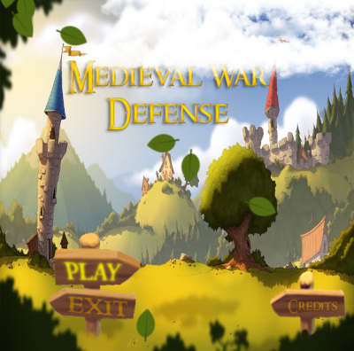
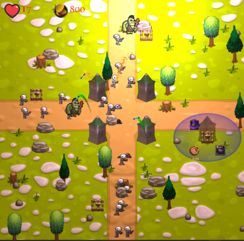
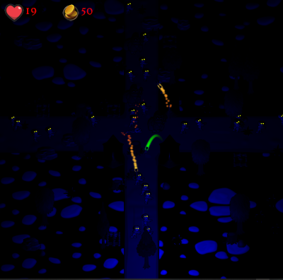

# Medieval War Defense

* Jogo do gênero Tower Defense (em desenvolvimento)
* Programado em C++ com OpenGL e SDL
* Arte e Som de terceiros
* Destaques:
    * Animações com sprite sheet
    * Sistema de partículas
    * Iluminação dinâmica 2D usando normal maps

* Requisitos:
   * Visual Studio Community 2019 com suporte a C++
   * Placa gráfica com suporte a OpenGL 3.3

* Instruções:
   * Abrir o projeto no Visual Studio Community 2019
   * Compilar e executar na configuração Release x86
   
* Imagens:

  
  
  
  
